# PROG8170-23S-Sec1-Software-Quality-Assurance-Assignment4-Automation-Functional-Testing

In this assignment we will move from unit testing, and integration testing, into system testing. To this end, you will test a prototype of a browser-based Web application using Selenium.

The software will determine (a) if insurance is to be provided and if so, (b) the insurance rate/quote of an individual based on their age, number accidents and their driving experience. The business requirements are as follows:

If the driver has 3 or more accidents on record, refuse to provide them with insurance. Otherwise, provide them with insurance.

If the driver has no driving experience, apply a base rate of 6000 annually. If a driver has 1 to 9 years of experience, apply a base rate of 4500 annually. Otherwise, apply a base rate of 3000 annually.

If a driver is 30 years old or older and have at least two years of driving experience, apply a rate reduction of 27% of the base rate.

## Requirements

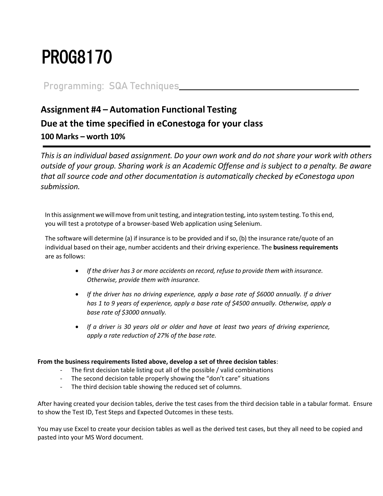

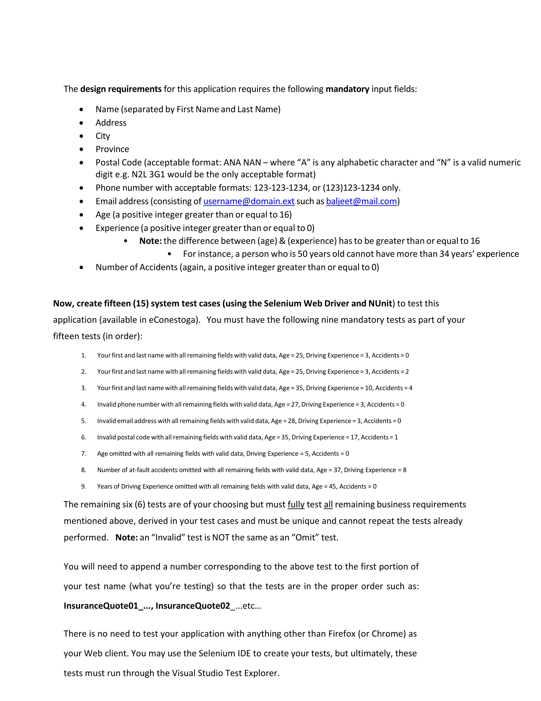

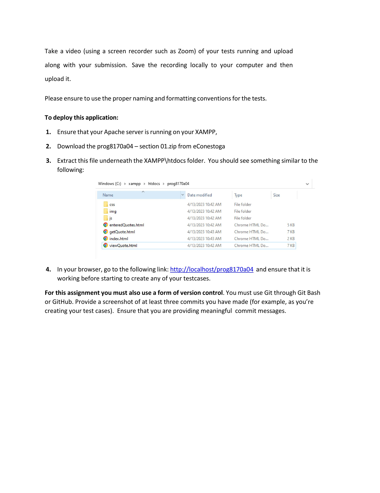

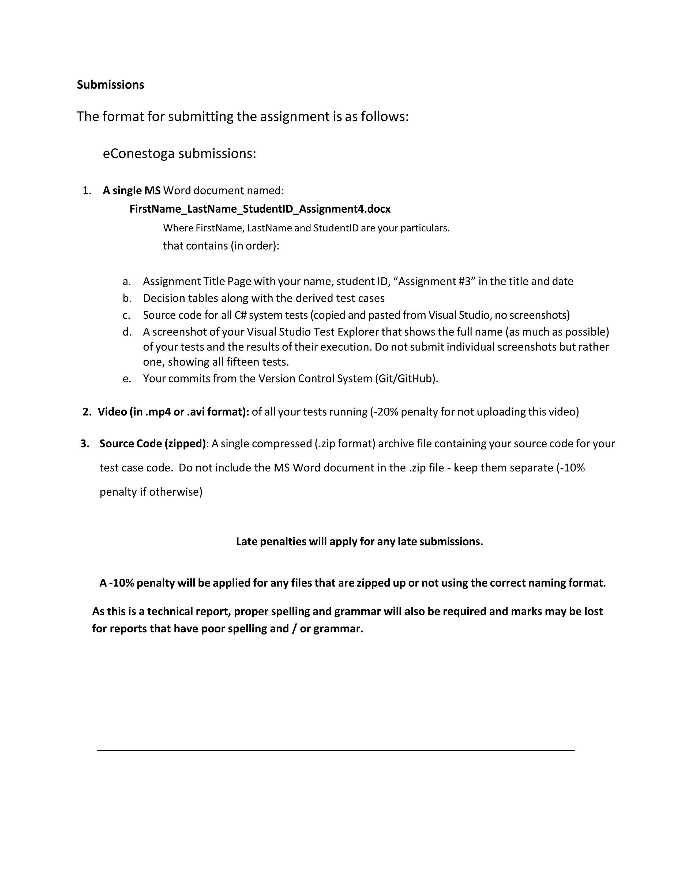

## Selenium IDE Project File

[InsuranceTestQuote.side](./doc/InsuranceTestQuote.side)

## Doc

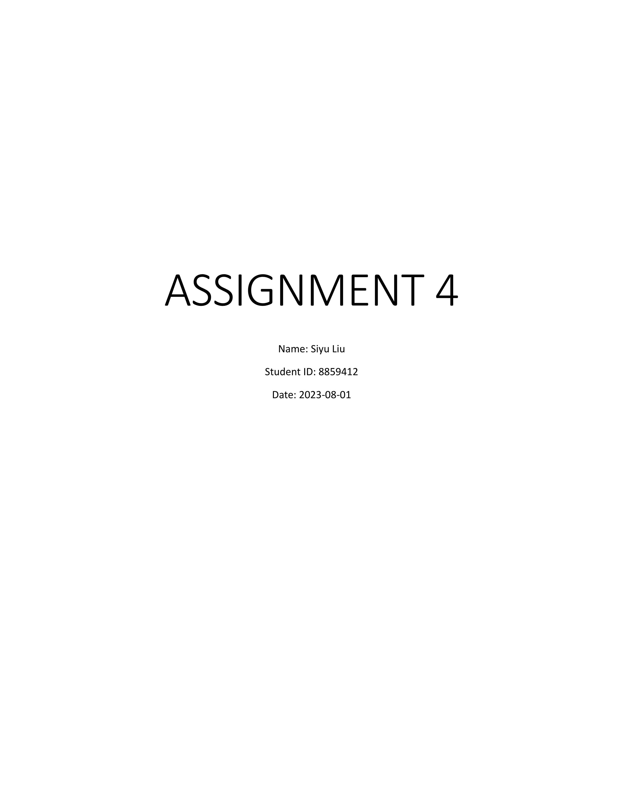

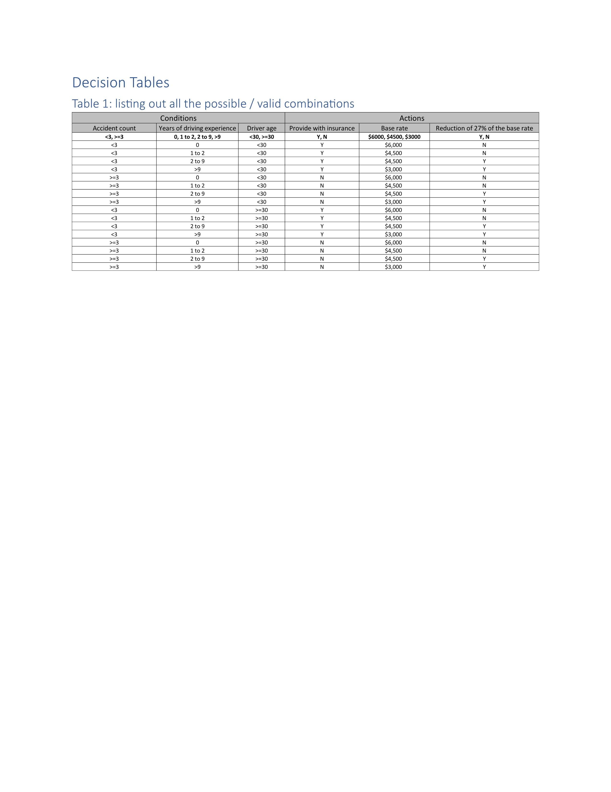

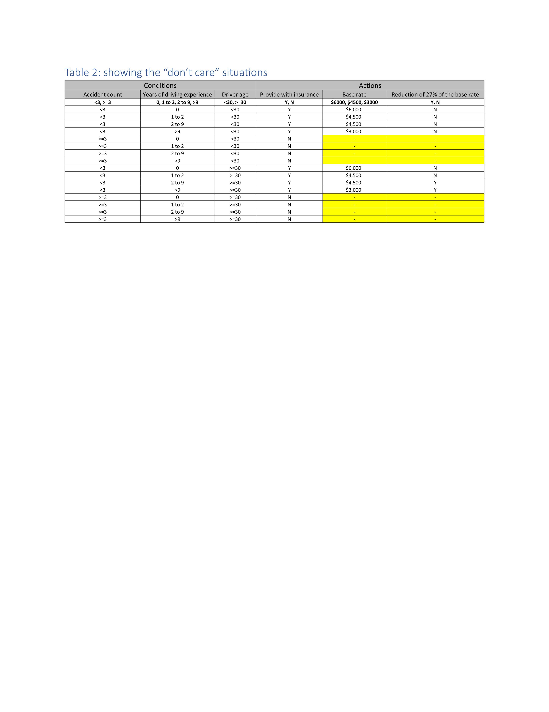

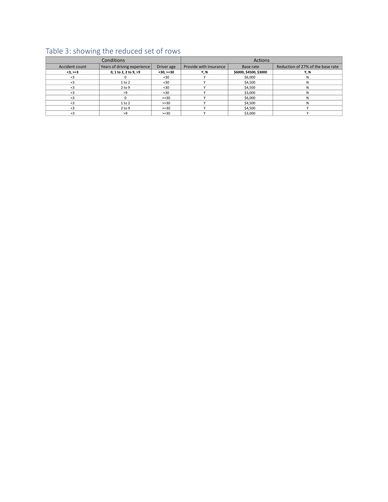

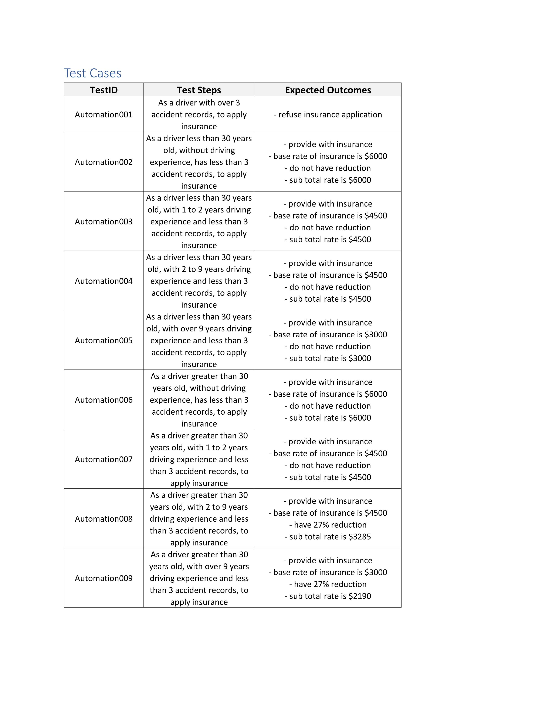

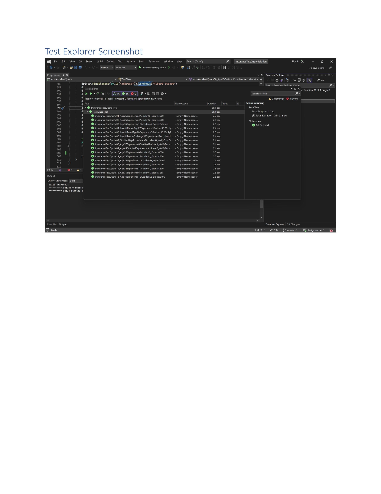

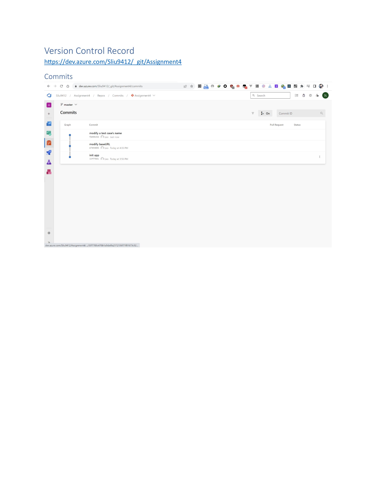

## Decision Table

[Assignment4_Decision_Table.xlsx](./doc/Assignment4_Decision_Table.xlsx)
